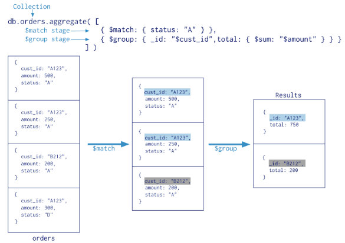
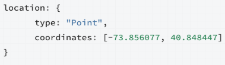
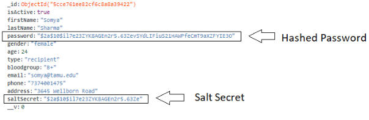
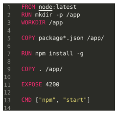

# Bloodbank

This project uses MEAN stack for Bloodbank.

This project has below versions:

Angular CLI: 7.3.8

Node: 10.15.3

Angular: 7.2.14

## Development server for Angular

Run `ng serve --open` for a dev server. Navigate to `http://localhost:4200/`. The app will automatically reload if you change any of the source files.

## Development server for NodeJS

Run `nodemon index.js` for a dev server. Navigate to `http://localhost:3000/`. The app will automatically reload if you change any of the source files.

## Steps
- Developing a connection from NodeJS to MongoDB using Express and Mongoose. Connection String used : mongodb+srv://sshjuser:<<password>>@cluster0-s1qny.mongodb.net/BloodbankDB?retryWrites=true
- Implementing API in NodeJS, creating GET, POST, PUT and DELETE APIs
- Developing the front-end in Angular 7 and routing requests to NodeJS controller
- Implement the back-end logic to match donors on the basis of compatible blood types
- Implement geocoding to identify the coordinates of a user, and use distance as a factor in matching donors to recipients
- Adding a Javascript Web Token to give user authentication and security measurements for the donors and receivers
- Hashing the password with salt-secret to enhance password security
- Adding reCAPTCHA to prevent web-scraping for donor information via bots
- Packaging the web app in a Docker instance and upload it to be hosted on the AWS Elastic Container Service.
  
## Aggregate Pipeline

  
## Geolocation

To specify GeoJSON data, use an embedded document with:
- a field named type that specifies the GeoJSON object type and
- a field named coordinates that specifies the object’s coordinates.
- If specifying latitude and longitude coordinates, list the longitude first and then latitude:
    - Valid longitude values are between -180 and 180, both inclusive.
    - Valid latitude values are between -90 and 90 (both inclusive).

## Password Hashing and Salting
Bcrypt stands for Blowfish cipher and crypt for the hashing function.

## JWT Authentication
Package “jsonwebtoken” is utilized to implement JWT authentication.

## Containerizing the App
The Dockerfile contains the steps needed to containerize the app. 

## Assessment
From a benchmarking of NoSQL databases, we found out that MongoDB maintains consistency and partition tolerance, meanwhile, other services, such as DynamoDB, ensures availability and partition tolerance. In the context of our application, we do not want to give “false hopes” to the recipients, therefore we think that consistency is more important in this context. This reinforces our decision of using MongoDB in the context of a healthcare app.

  

